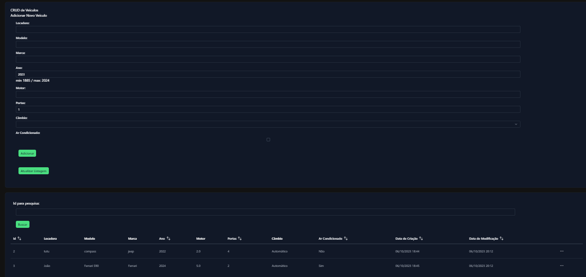

Como foi proposto para o Backend, utilizei node.js, com as dependências express mysql2, sequelize e nodemon.
No Frontend, considerei utilizar o framework Nuxt, Vue3.

## Passo a passo para iniciar o projeto:

Utilizei **Ubuntu 20.04** no **WSL2**

## Instalação e inicialização:

### Criação do projeto com Nuxt:

```bash
npx nuxi@latest init locadoradecarros
```

Utilizar npm.

### Instalação das dependências do Backend:

```bash
npm install express
```

```bash
npm install mysql2
```

```bash
npm install sequelize
```

```bash
npm install nodemon --save-dev
```

```bash
npm install cors
```

```bash
npm install axios
```

### Instalação do docker:

Atualize os pacotes do sistema e instale as dependências

```bash
sudo apt update
```

```bash
sudo apt install apt-transport-https ca-certificates curl software-properties-common
```

Adicione a chave GPG oficial do repositório do Docker:

```bash
curl -fsSL https://download.docker.com/linux/ubuntu/gpg | sudo gpg --dearmor -o /usr/share/keyrings/docker-archive-keyring.gpg
```

Adicione o repositório oficial do Docker às fontes de pacotes do sistema:

```bash
echo "deb [signed-by=/usr/share/keyrings/docker-archive-keyring.gpg] https://download.docker.com/linux/ubuntu $(lsb_release -cs) stable" | sudo tee /etc/apt/sources.list.d/docker.list > /dev/null
```

Atualize o índice de pacotes novamente para incluir o repositório do Docker:

```bash
sudo apt update
```

Instale o Docker:

```bash
sudo apt install docker-ce docker-ce-cli containerd.io
```

### Inicialização do Docker:

```bash
sudo dockerd
```

#### Comandos basicos do docker:

Inicializar o docker

```bash
sudo systemctl start docker
```

Ver os status do docker

```bash
sudo systemctl status docker
```

Desligar o service do docker

```bash
sudo systemctl stop docker
```

#### [Baixar MySql](https://dev.mysql.com/downloads/installer/)

### Banco de dados MySQL

```bash
mkdir /tmp/mysql-data
docker run --name basic-mysql --rm -v /tmp/mysql-data:/var/lib/mysql -e MYSQL_ROOT_PASSWORD=ANSKk08aPEDbFjDO -e MYSQL_DATABASE=testing -p 3307:3306 -it mysql:8.0
```

## Para iniciar o projeto, use os seguintes comandos:

### Inicie o banco de dados (em um terminal separado)

```bash
sudo docker run --name basic-mysql --rm -v /tmp/mysql-data:/var/lib/mysql -e MYSQL_ROOT_PASSWORD=ANSKk08aPEDbFjDO -e MYSQL_DATABASE=testing -p 3307:3306 -it mysql:8.0
```

### Configurar e iniciar o projeto (Backend/Frontend)

```bash
cd LocadoraDeCarros
```

```bash
npm install
```

```bash
npm run dev
```

##

### Espero que gostem do meu projeto.

### Obrigado pela oportunidade!

### At.te, João Vitor Soares da Silva.
